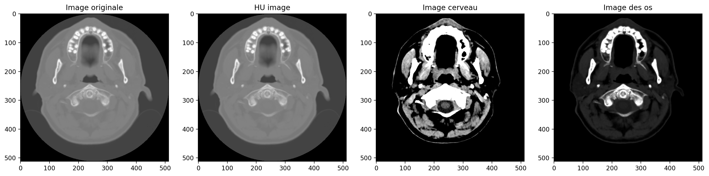

#  Prepocessing-des-Images-CT-scans - DICOM----poumons-et-cerveau----- EN COURS ….
Le but de ce notebook est de se familiariser avec le pre-processing des images médicales en format DICOM, une étape fondamentale dans tout processus de construction d'un modèle de machine ou deep learning. Les images de CT-scans utilisés:  
- Un CT-scans thoracique de 99 slices d'un patient disponibles à l'adresse : https://www.kaggle.com/datasets/dmisky/dlwptvolumetricdicomlung
le preprocessing suivi est basé sur le tutorial de Guido zuidof : https://www.kaggle.com/code/gzuidhof/full-preprocessing-tutorial/notebook#Zero-centering

- CT-scans du cerveau d'une vingtaine des patients de UCLH Stroke EIT Dataset disponibles à l'adresse : 
https://zenodo.org/record/1199398
le preprocessing suivi est basé sur les références de l'article de E. SMERT : 
https://towardsdatascience.com/medical-image-pre-processing-with-python-d07694852606

